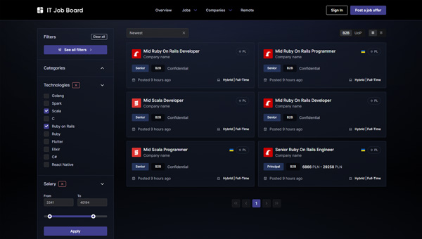
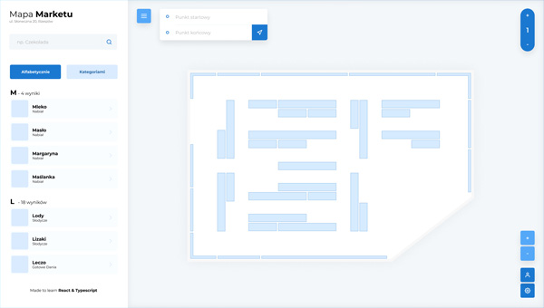
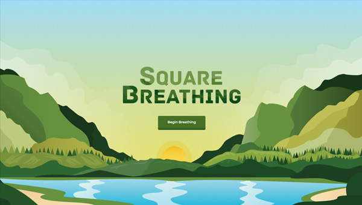
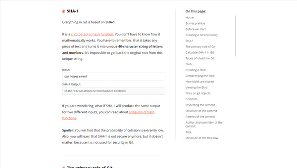
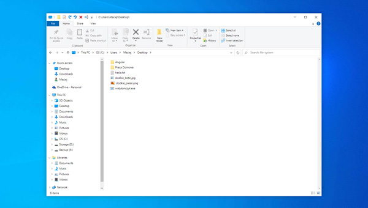
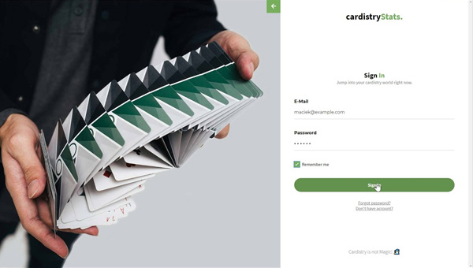
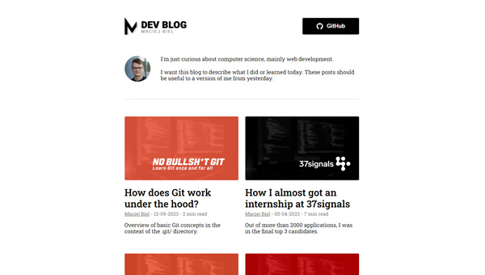

### Hi there 👋

Currently I'm looking for a job as a **Full-Stack Ruby on Rails Developer** or a **Front-End Developer**. I'm also open to other opportunities.

I'm based in **Poland**, but I'm open to remote work.

### My side projects:
It's worth checking out the project [ChronLife](https://github.com/maciejb2k/chronlife), as it's the biggest fullstack project (Rails 7 + Hotwire) on my GitHub.

#### Backend:
-  - **\*NEW\*** **[ChronLife](https://github.com/maciejb2k/chronlife)** - Full-stack social platform for people with chronic diseases.
-  - **[IT job board](https://github.com/maciejb2k/it-job-board-rails)** - REST API job posting platform.
-  - **[Cookbook](https://github.com/maciejb2k/cookbook-RBE4)** - group project done during onsite Rails academy.

#### Frontend:
-  - **\*NEW\*** **[IT job board](https://github.com/maciejb2k/it-job-board-next)** - front-end for my IT job board API made with the Next.js 13.5.
-  - **[Windows 10 explorer clone](https://github.com/maciejb2k/windows-explorer-clone)** - I recreated the Windows Explorer 1:1.
-  - **[Pathfinding in store](https://github.com/maciejb2k/pathfinding_app)** - app for finding the shortest path in store.
-  - **[Square breathing](https://github.com/maciejb2k/square_breathing)** - app for practising square breathing technique.
-  - **[CardistryStats](https://github.com/maciejb2k/cardistrystats_frontend)** - social platform connecting people shuffling cards.
-  - **[Sorting algorithms](https://github.com/maciejb2k/sorting_algorithms_js)** - app visualizing basic sorting algorithms.
-  - **[Dev blog](https://github.com/maciejb2k/dev-blog)** - personal blog about what I learned.

#### Others:
-  - **\*NEW\*** **[No Bullsh*t Git](https://github.com/maciejb2k/no-bs-git)** - my take on explaining fundamental Git concepts.
-  - **[Electronics store](https://github.com/maciejb2k/electronics-store)** - full-stack project with back-end made in PL/pgSQL.

#### Screenshots:
You can take a quick look at the UI of some of my side projects below.

##### Chronlife:
<a href="https://github.com/maciejb2k/chronlife">
  

    
    
  

</a>

##### IT Job Board:
<a href="https://github.com/maciejb2k/it-job-board-next">
  

    
    
  

</a>

##### Pathfinding in the store:
<a href="https://github.com/maciejb2k/pathfinding_app">
  

    
    
  

</a>

##### Square breathing:
<a href="https://github.com/maciejb2k/square_breathing">
  

    
    
  

</a>

##### No Bullsh*t Git:
<a href="https://github.com/maciejb2k/no-bs-git">
  

    
    
  

</a>

##### Windows 10 Explorer clone:
<a href="https://github.com/maciejb2k/windows-explorer-clone">
  

    
    
  

</a>

##### CardistryStats:
<a href="https://github.com/maciejb2k/cardistrystats_frontend">
  

    
    
  

</a>

##### Dev Blog:
<a href="https://github.com/maciejb2k/dev-blog">
  

    
    
  

</a>