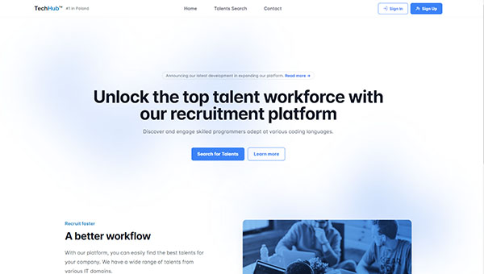
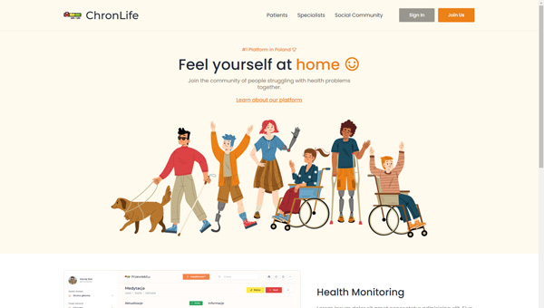
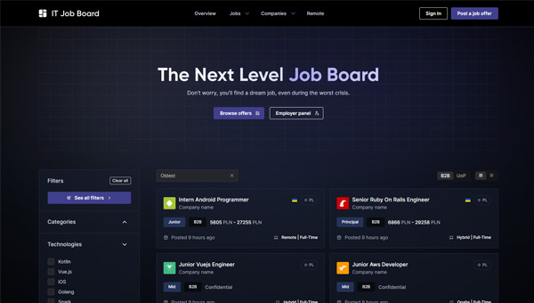
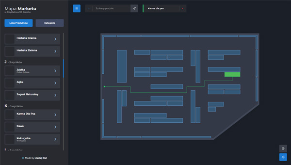
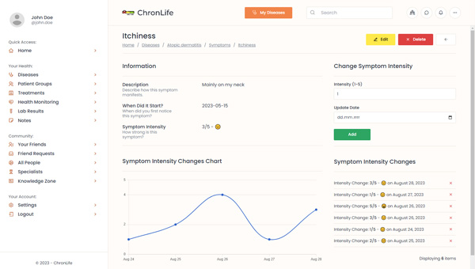
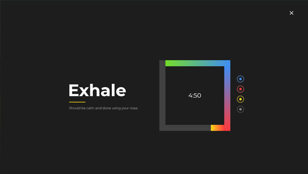
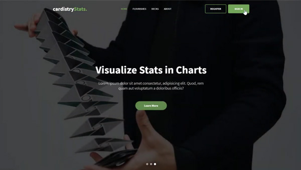
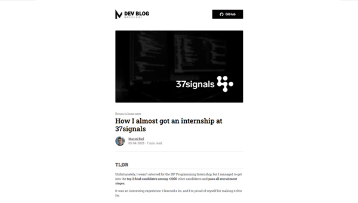
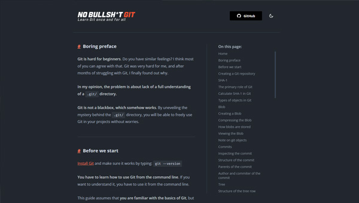
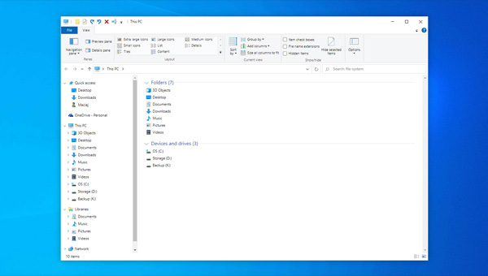

### Hello there 💫
Currently, I'm working as a Ruby on Rails Developer. Below, you can check out some of my side projects that I made for fun over the past few years:

#### Backend:
<table>
  <tr>
    <td></td>
    <td><strong><a href="https://github.com/maciejb2k/chronlife">ChronLife</a></strong> - Full-stack social platform for people with chronic diseases.</td>
  </tr>
  <tr>
    <td></td>
    <td><strong><a href="https://github.com/maciejb2k/ruby-on-rails-security">Security in Rails</a></strong> - OWASP Top 10 vulnerabilities demonstrated in Rails applications.</td>
  </tr>
  <tr>
    <td></td>
    <td><strong><a href="https://github.com/maciejb2k/f1-telemetry">F1 Telemetry</a></strong> - Microservices-based system for real-time F1 data monitoring using RabbitMQ and Docker.</td>
  </tr>
  <tr>
    <td></td>
    <td><strong><a href="https://github.com/maciejb2k/silent-dose">Silent Dose</a></strong> - App for tracking dietary supplement intake.</td>
  </tr>
  <tr>
    <td></td>
    <td><strong><a href="https://github.com/maciejb2k/project-management-graphql">Project Management</a></strong> - Simple project management system with GraphQL API.</td>
  </tr>
  <tr>
    <td></td>
    <td><strong><a href="https://github.com/maciejb2k/it-job-board-rails">IT job board</a></strong> - REST API job posting platform.</td>
  </tr>
  <tr>
    <td></td>
    <td><strong><a href="https://github.com/maciejb2k/rails-ai-chatbots">AI Chatbots</a></strong> - Create a RAG AI Chatbot with knowledge store from any website.</td>
  </tr>
  <tr>
    <td></td>
    <td><strong><a href="https://github.com/maciejb2k/toiletpeek-api">ToiletPeek</a></strong> - real-time ESP32 + NestJS + Socket.io data streaming.</td>
  </tr>
</table>

#### Frontend:
<table>
  <tr>
    <td></td>
    <td><strong><a href="https://github.com/maciejb2k/it-job-board-next">IT job board</a></strong> - front-end for my IT job board API made with the Next.js 13.5.</td>
  </tr>
  <tr>
    <td></td>
    <td><strong><a href="https://github.com/maciejb2k/tech-hub">TechHub</a></strong> - global freelance network for engineers.</td>
  </tr>
  <tr>
    <td></td>
    <td><strong><a href="https://github.com/maciejb2k/windows-explorer-clone">Windows 10 explorer clone</a></strong> - I recreated the Windows Explorer 1:1.</td>
  </tr>
  <tr>
    <td></td>
    <td><strong><a href="https://github.com/maciejb2k/pathfinding_app">Pathfinding in the store</a></strong> - app for finding the shortest path in the store.</td>
  </tr>
  <tr>
    <td></td>
    <td><strong><a href="https://github.com/maciejb2k/square_breathing">Square breathing</a></strong> - app for practising square breathing technique.</td>
  </tr>
  <tr>
    <td></td>
    <td><strong><a href="https://github.com/maciejb2k/cardistrystats_frontend">CardistryStats</a></strong> - social platform connecting people shuffling cards.</td>
  </tr>
  <tr>
    <td></td>
    <td><strong><a href="https://github.com/maciejb2k/sorting_algorithms_js">Sorting algorithms</a></strong> - app visualizing basic sorting algorithms.</td>
  </tr>
  <tr>
    <td></td>
    <td><strong><a href="https://github.com/maciejb2k/dev-blog">Dev blog</a></strong> - personal blog about what I learned.</td>
  </tr>
</table>

#### Others:
<table>
  <tr>
    <td></td>
    <td><strong><a href="https://github.com/maciejb2k/no-bs-git">No Bullsh*t Git</a></strong> - my take on explaining fundamental Git concepts.</td>
  </tr>
  <tr>
    <td></td>
    <td><strong><a href="https://github.com/maciejb2k/electronics-store">Electronics store</a></strong> - full-stack project with back-end made in PL/pgSQL.</td>
  </tr>
</table>

#### Screenshots:
You can take a look at the UI on some of my side projects below.

  
  
  
  
  

  
  
  
  
  

