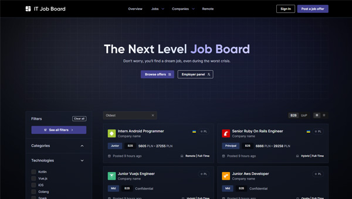

### Hello there 💫
Currently, I'm working as a Ruby on Rails Developer. Below, you can check out some of my side projects that I made for fun over the past few years:

#### Backend:
-  - **[ChronLife](https://github.com/maciejb2k/chronlife)** - Full-stack social platform for people with chronic diseases.
-  - **[Project Management](https://github.com/maciejb2k/project-management-graphql)** - Simple project management system with GraphQL API.
-  - **[IT job board](https://github.com/maciejb2k/it-job-board-rails)** - REST API job posting platform.
-  - **[Cookbook](https://github.com/maciejb2k/cookbook-RBE4)** - group project done during onsite Rails academy.
-  - **[ToiletPeek](https://github.com/maciejb2k/toiletpeek-api)** - real-time ESP32 + NestJS + Socket.io data streaming.

#### Frontend:
-  - **[IT job board](https://github.com/maciejb2k/it-job-board-next)** - front-end for my IT job board API made with the Next.js 13.5.
-  - **[TechHub](https://github.com/maciejb2k/tech-hub)** - global freelance network for engineers.
-  - **[Windows 10 explorer clone](https://github.com/maciejb2k/windows-explorer-clone)** - I recreated the Windows Explorer 1:1.
-  - **[Pathfinding in the store](https://github.com/maciejb2k/pathfinding_app)** - app for finding the shortest path in the store.
-  - **[Square breathing](https://github.com/maciejb2k/square_breathing)** - app for practising square breathing technique.
-  - **[CardistryStats](https://github.com/maciejb2k/cardistrystats_frontend)** - social platform connecting people shuffling cards.
-  - **[Sorting algorithms](https://github.com/maciejb2k/sorting_algorithms_js)** - app visualizing basic sorting algorithms.
-  - **[Dev blog](https://github.com/maciejb2k/dev-blog)** - personal blog about what I learned.

#### Others:
-  - **[No Bullsh*t Git](https://github.com/maciejb2k/no-bs-git)** - my take on explaining fundamental Git concepts.
-  - **[Electronics store](https://github.com/maciejb2k/electronics-store)** - full-stack project with back-end made in PL/pgSQL.

#### Screenshots:
You can take a look at the UI on some of my side projects below.

  
  
  
  
  

  
  
  
  
  

